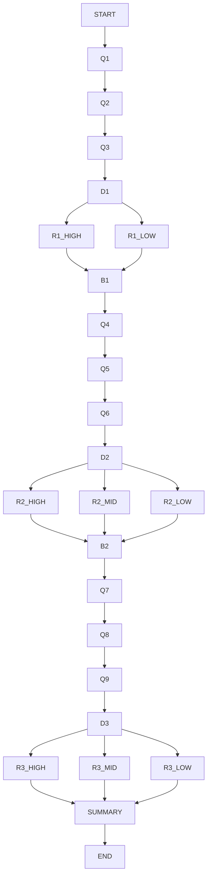

Reflection Tree Assignment

 Overview
This project is a deterministic reflection tool using a decision tree.

It explores:
1. Locus of Control  
2. Contribution  
3. Scope of Impact  

Design

#Questions
The questions are designed to capture real behavior through structured choices instead of free text.

Logic
- Decision nodes route based on signals  
- Each axis produces a reflection  
- Same input always gives same output (deterministic)  

Psychology
- Locus of Control (Rotter)  
- Growth mindset  
- Self-transcendence (Maslow)
  
Improvements
- Add scoring system  
- Improve reflection depth  
- Build UI
- 
Diagram

